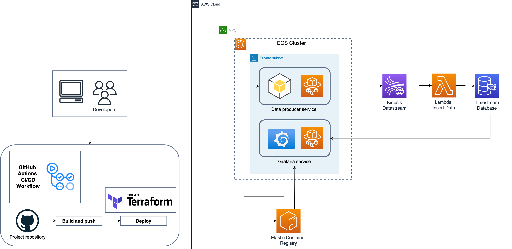

# 
  **ECS + Kinesis + Timestream Integration Project**  

This project implements a Data Pipeline that takes real-time events and inserts them into an `Amazon Timestream` database and then these events are visualized using `Grafana`. This whole project was built on top of `Terraform` as an IaC (Infrastructure as Code) tool and using AWS services.

## **Architecture** :triangular_ruler:
This section shows a diagram of the project architecture. It shows how AWS services and project elements interact with each other.

    

## **Services** :space_invader:
- [Amazon Elastic Container Service (ECS)](https://aws.amazon.com/ecs/): Amazon Elastic Container Service (Amazon ECS) is a fully managed container orchestration service that simplifies your deployment, management, and scaling of containerized applications.

- [Amazon Elastic Container Registry (ECR)](https://aws.amazon.com/es/ecr/): Amazon Elastic Container Registry (Amazon ECR) is a fully managed container registry offering high-performance hosting, so you can reliably deploy application images and artifacts anywhere.

- [Amazon Kinesis Data Streams](https://aws.amazon.com/es/kinesis/data-streams/): Amazon Kinesis Data Streams is a serverless streaming data service that makes it easy to capture, process, and store data streams at any scale.

- [AWS Lambda](https://aws.amazon.com/lambda/?nc1=h_ls): AWS Lambda is a serverless, event-driven compute service that lets you run code for virtually any type of application or backend service without provisioning or managing servers.

- [Amazon Timestream](https://aws.amazon.com/timestream/): Amazon Timestream is a fast, scalable, and serverless time-series database service that makes it easier to store and analyze trillions of events per day up to 1,000 times faster.

- [Amazon Virtual Private Cloud (VPC)](https://aws.amazon.com/vpc/?nc1=h_ls): Amazon Virtual Private Cloud (Amazon VPC) gives you full control over your virtual networking environment, including resource placement, connectivity, and security.

## **Tools** :wrench:
- [Terraform](https://www.terraform.io/): HashiCorp Terraform is an infrastructure as code tool that lets you define both cloud and on-prem resources in human-readable configuration files that you can version, reuse, and share.

- [Python](https://www.python.org/): Python is an interpreted, object-oriented, high-level programming language with dynamic semantics. Its high-level built in data structures, combined with dynamic typing and dynamic binding, make it very attractive for Rapid Application Development, as well as for use as a scripting or glue language to connect existing components together.

- [Grafana](https://grafana.com/): Grafana is an open source interactive data-visualization platform, developed by Grafana Labs, which allows users to see their data via charts and graphs that are unified into one dashboard (or multiple dashboards!) for easier interpretation and understanding. 

- [GitHub Actions](https://github.com/features/actions): GitHub Actions is a continuous integration and continuous delivery (CI/CD) platform that allows you to automate your build, test, and deployment pipeline. You can create workflows that build and test every pull request to your repository, or deploy merged pull requests to production.

## **Setup** :rocket:

