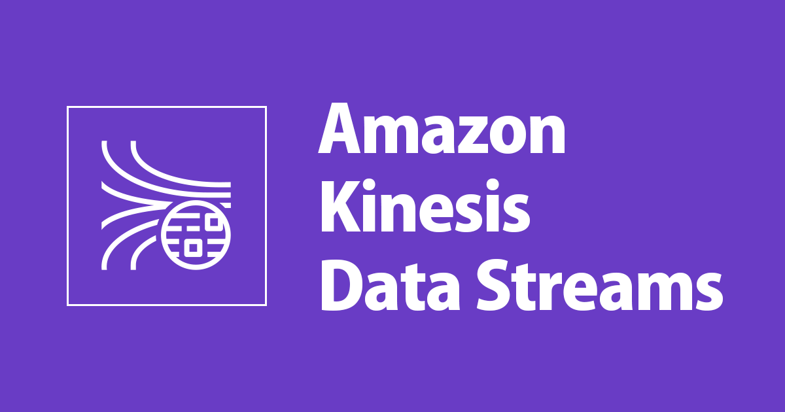

# 
  **Kinesis Data Stream**  

The service creates a `Kinesis Data Stream` using AWS, the events of this stream are sent by the `Data Producer` service and the creation of this service was completely developed using Terraform as IaC tool.

    
    

This stream is important for this project because it carries the real-time events that were produced by the Data Producer service and then integrates with other services such as Lambda to get the events and put them into a Database.