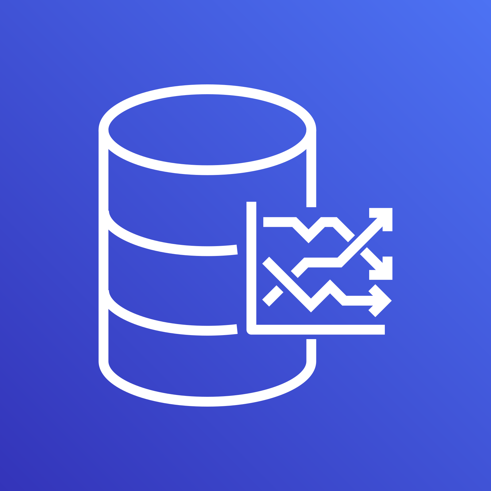
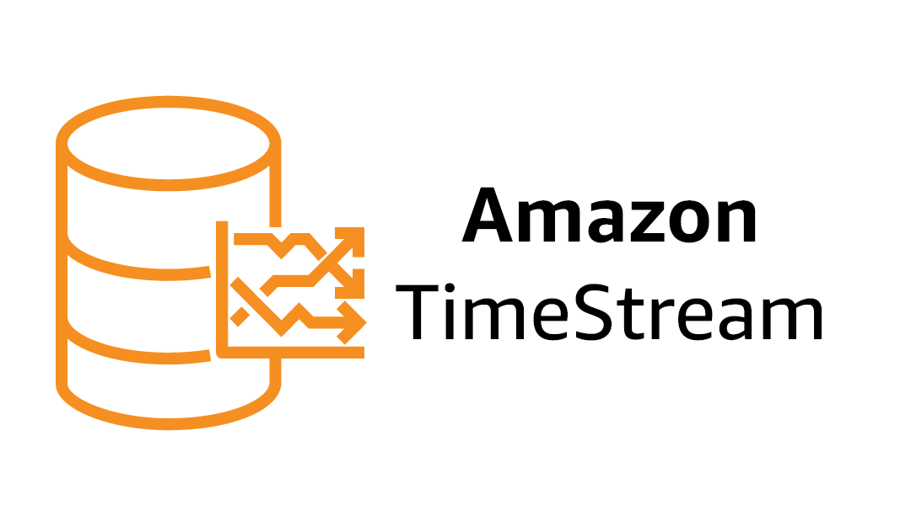

# 
  **Timestream**  

This service creates a database and a `Timestream` table, this database is optimized to store and process time series data. The data generated by the data producer service is obtained through a Kinesis data stream and a Lambda function processes and inserts it into the database.

    
    

This database is one of the most important elements and services of this project, since the main objective of this project is to test and test the advantages and functionalities of this service.